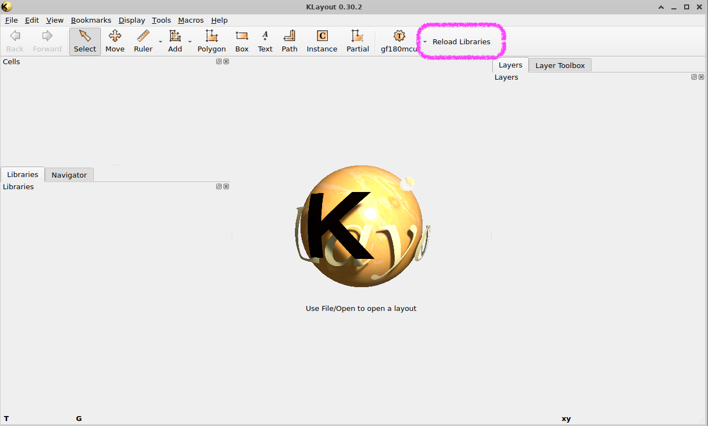

# How to Organize Your Design Libraries

Here is a recommended library organization when using a repo built with the [**iic-osic-tools-project-template**](https://github.com/Jianxun/iic-osic-tools-project-template).

- Design **libraries** are stored as folders in `/foss/designs/libs`:
  - in library folders you have a folder for each **cell**:
    - in the cell folder you have a file for each **view**:
        - `.sch` schematics
        - `.sym` symbols
        - `.spice` netlists (e.g. for LVS)
        - `.gds` layout for the cell
    - cells higher in the design hierarchy use symbols or layouts of cells lower in the hierarchy, but they are at the same 'level' in the folder structure

This approach has proven effective in other EDA tool chains. Whereas the folder hierarchy is not as deep as the design hierarchy (all cells are in the same library folder even if they are children of parent cells), this simplifies future reuse. 

Cells in design libraries should only contain *physical circuit elements* from the PDK (mosfets, resistors, capacitors, ... ) and no ideal elements like voltage or current sources, ideal resistors or capacitors, dependent sources. 

- **Test benches** are stored in separate library folders:
  - this ensures that cells and verification schematics are clearly separated; this is an important practice for LVS and tape-out success. 

## Example

Here is a library for a switch matrix design; the top cell is `swmatrix_5_10` which uses the `DFF_2phase_1` and the `TGate` cells. (This is a reduced view, a full switch matrix design would require more cells.)

### File Tree View

```
/foss/designs/libs/
├── switchmatrix/
│   ├── swmatrix_5_10/
│   │   ├── swmatrix_5_10.sch
│   │   ├── swmatrix_5_10.sym
│   │   └── swmatrix_5_10.gds
│   ├── DFF_2phase_1/
│   │   ├── DFF_2phase_1.sch
│   │   ├── DFF_2phase_1.sym
│   │   └── DFF_2phase_1.gds
│   └── TGate/
│       ├── TGate.sch
│       ├── TGate.sym
│       └── TGate.gds
└── tb_switchmatrix/
    ├── tb_DFF_2phase_1/
    │   └── tb_DFF_2phase_1.sch
    ├── tb_TGate/
    │   └── tb_TGate.sch
    └── tb_swmatrix_5_10/
        └── tb_swmatrix_5_10.sch
```

### Flat File List

```
/foss/designs/libs/switchmatrix/swmatrix_5_10/swmatrix_5_10.sch
/foss/designs/libs/switchmatrix/swmatrix_5_10/swmatrix_5_10.sym
/foss/designs/libs/switchmatrix/swmatrix_5_10/swmatrix_5_10.gds
/foss/designs/libs/switchmatrix/DFF_2phase_1/DFF_2phase_1.sch
/foss/designs/libs/switchmatrix/DFF_2phase_1/DFF_2phase_1.sym
/foss/designs/libs/switchmatrix/DFF_2phase_1/DFF_2phase_1.gds
/foss/designs/libs/switchmatrix/TGate/TGate.sch
/foss/designs/libs/switchmatrix/TGate/TGate.sym
/foss/designs/libs/switchmatrix/TGate/TGate.gds
/foss/designs/libs/tb_switchmatrix/tb_DFF_2phase_1/tb_DFF_2phase_1.sch
/foss/designs/libs/tb_switchmatrix/tb_TGate/tb_TGate.sch
/foss/designs/libs/tb_switchmatrix/tb_swmatrix_5_10/tb_swmatrix_5_10.sch
```

# Schematic Editing

**Always** launch `xschem` from `/foss/designs/libs`
```
> cd /foss/design/libs
> xschem
```
- this will ensure that the schematics include the library folder as part of the path for the symbols in `xschem`.

- Review additional details in [iic-osic-tools-project-template/docs/schematic_workflow](https://github.com/Jianxun/iic-osic-tools-project-template/blob/main/docs/schematic_workflow.md).

# Layout Editing

We recommend using klayout with the `klayout_lib_manager.py` utility for library management. 

- Launch `klayout` from `/foss/design/libs`; if you are working in a repo using the *iic-osic-tools-project-template* then `klayout` is an alias with the necessary command-line arguments:
```
> cd /foss/designs/libs
> klayout
```
- Otherwise copy the `.py` script and launch `klayout` similar as below. 

```
> cd /foss/designs/libs
> klayout -rm $DESIGNS/scripts/klayout_lib_manager.py -geometry 1600x900+100+50 -e
```

- Once in klayout --> hit `update_libraries` which will scan `/foss/designs/libs` and all its subfolders for `.gds` files and create an alias listed in `/foss/designs/libs/libs.json`. 



- When creating a new cell in klayout, make sure to change the default TOP cell name of *TOP* with the actual name of your cell; this will be a time-saver once you start doing LVS. 

- Review additional details in [iic-osic-tools-project-template/docs/layout_workflow](https://github.com/Jianxun/iic-osic-tools-project-template/blob/main/docs/layout_workflow.md).

# How to Include Other Libraries Outside your GitHub Repository

## Basic: Use `git submodule`

- Add the GitHub repository to your `/foss/design/libs` folder

- Example, lets add the library `switch_matrix_gf180mcu_9t5v0` from *mosbiuschip*; make sure you are in your root folder of your design repo; the `libs` folder should then be at `./designs/libs` from there. 

```
git submodule add https://github.com/mosbiuschip/switch_matrix_gf180mcu_9t5v0.git ./designs/libs/switch_matrix_gf180mcu_9t5v0

```
- Now commit your design repo update; you can also `git push` it to your *origin*. 

```
git commit -am "Add switch_matrix_gf180mcu_9t5v0 as a submodule"
```

- Make sure to check with your favorite `git` and GitHub instructions (GPTs are pretty well versed in the topic) to verify that everything went OK. E.g., the following commands might be helpful:
```
git status
git submodule status
cat .gitmodules
```

- The submodule is now a **separate** repo with its own status, branches, etc. that operates independently from your own main repository. You need to maintain (i.e. *branches*, *commit*, *push*, ... ) each separately. 

## Advanced: Use `ams-compose`

- Take a look at the [`ams-compose`](https://github.com/Jianxun/ams_compose) from Jianxun Zhu for a more refined way of building up a design library -- Note that this is experimental code. 
