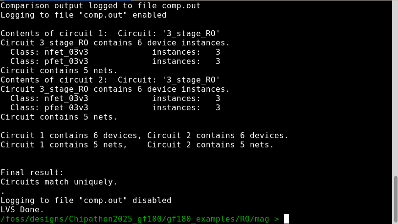

Run the following command to run LVS flow with netgen.

```
netgen -batch lvs "../gds/3_stage_RO_extracted.cir 3_stage_RO" "../xschem/simulation/3_stage_RO.spice 3_stage_RO" $PDK_ROOT/$PDK/libs.tech/netgen/${PDK}_setup.tcl
```

<p align="center">
   
</p>
