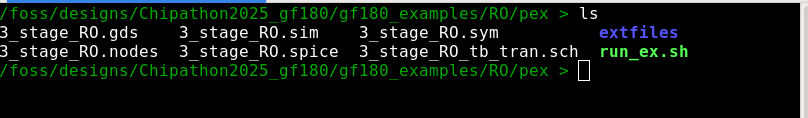

Copy the 3 stage RO gds to the pex folder. 

The run the following command:
```
./run_ex.sh 3_stage_RO
```
<p align="center">
   
</p> 

<p align="center">
   
</p> 

Then, create or copy the testbench and symbol files.

<p align="center">
   
</p> 

Double check the order of the pinlist in both .spice files.

<p align="center">
   
</p> 

Finally, run the PEX simulation.
<p align="center">
   
</p> 
