Once the LVS and DRC flows are clean, then, the parasitic extraction flow is required to test the design after the layout is implemented. To keep everything organized, a PEX folder was created to include all the files associated with the PEX flow. First, copy the layout file (inverter.gds) to this folder. Then, the following command must be entered into the terminal to initiate the parasitic extraction flow:

```
.\run_ex.sh inverter
```
Check the **run_ex.sh** file to identify all the commands used for extraction. Remember to make this file executable (this should only be done once). The command used to make it executable is:

```
chmod +x run_ex.sh
```

Finally, the parameter **inverter** corresponds to the cell name stored in the **inverter.gds** file. In this case, the name is the same as the one used in the schematic file to avoid any issues during the LVS flow.

<p align="center">
   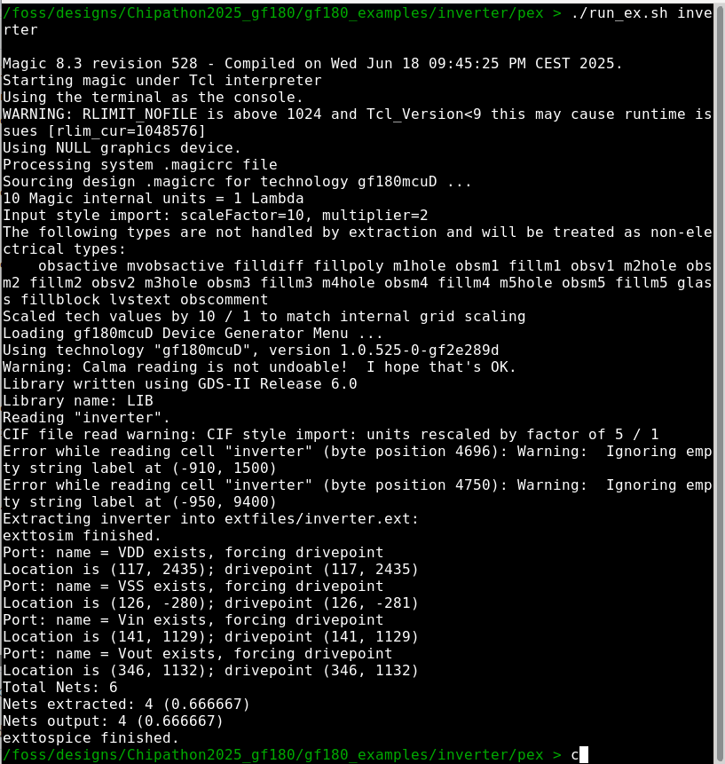
</p> 

Several files were created during this step. Please review all of them, as indicated in the figure below.

<p align="center">
   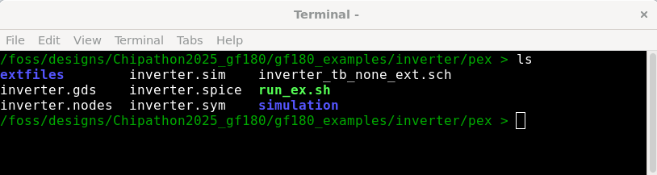
</p> 

Now, take a look at the spice file created after extraction that includes capacitive and resistive elements, as shown below.

<p align="center">
   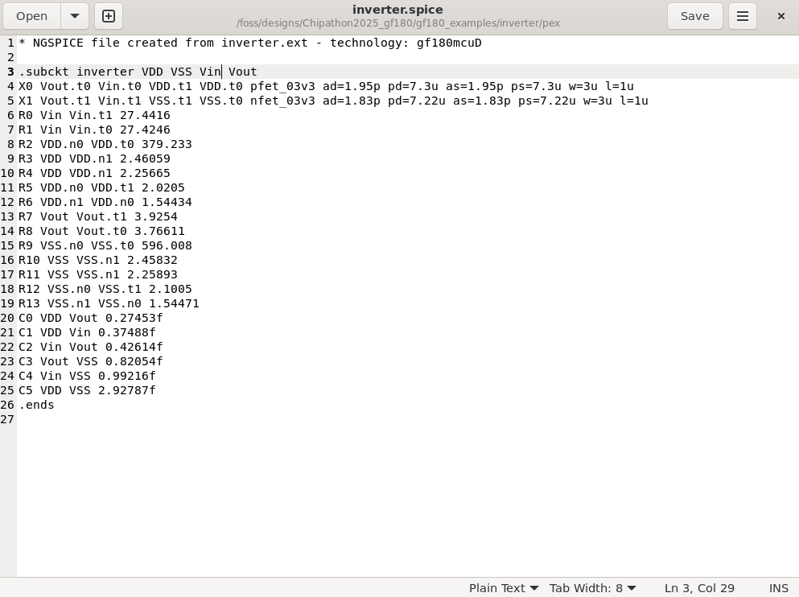
</p> 

In another tab of the Linux environment, open the netlist created by Xschem. You will notice that the pin order is different. Change the pin list order of the PEX SPICE file to match the order in the Xschem SPICE file.

<p align="center">
   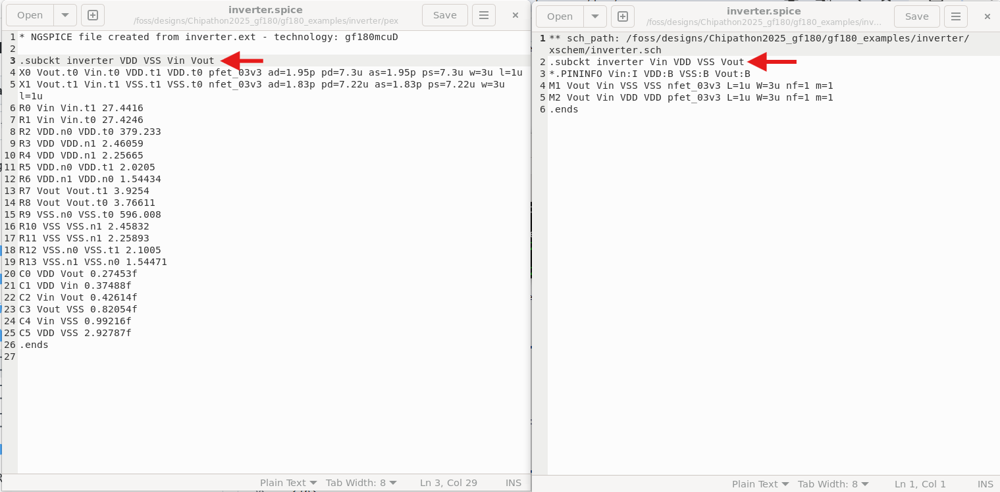
</p> 

<p align="center">
   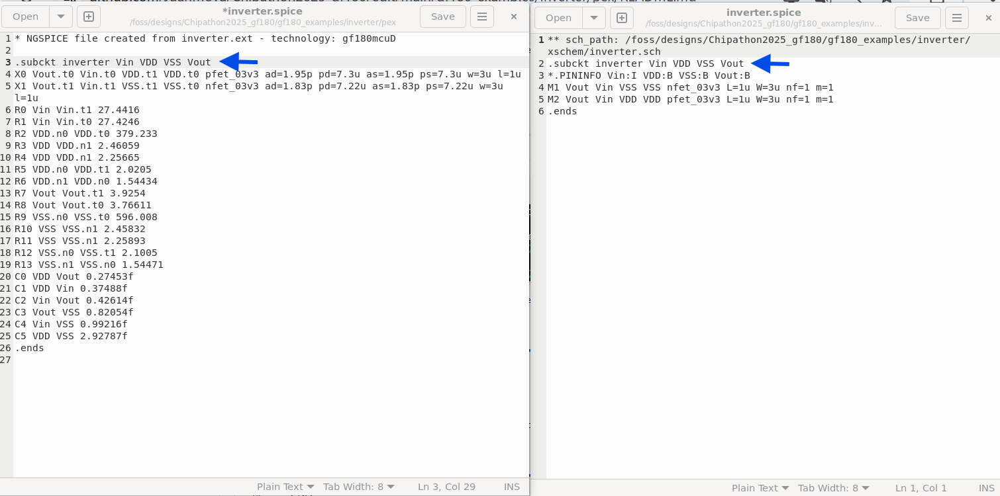
</p> 

After matching pinlists, create a testbench schematic in the pex folder as indicated below.

<p align="center">
   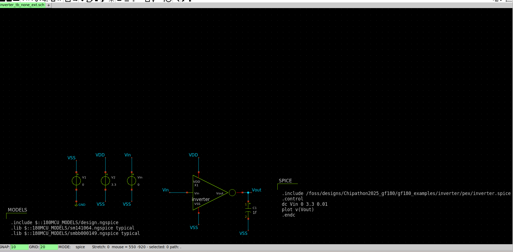
</p> 

A new **inverter.sym** file was created in the pex folder, press **Q** key and include the properties indicated below.

<p align="center">
   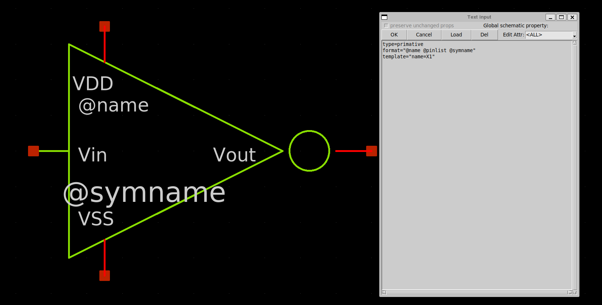
</p> 

Finally, you can run the inverter testbench simulation with the PEX SPICE file included. Before running the simulation, remember to check the **simulation dir** option. The simulation results are below.

<p align="center">
   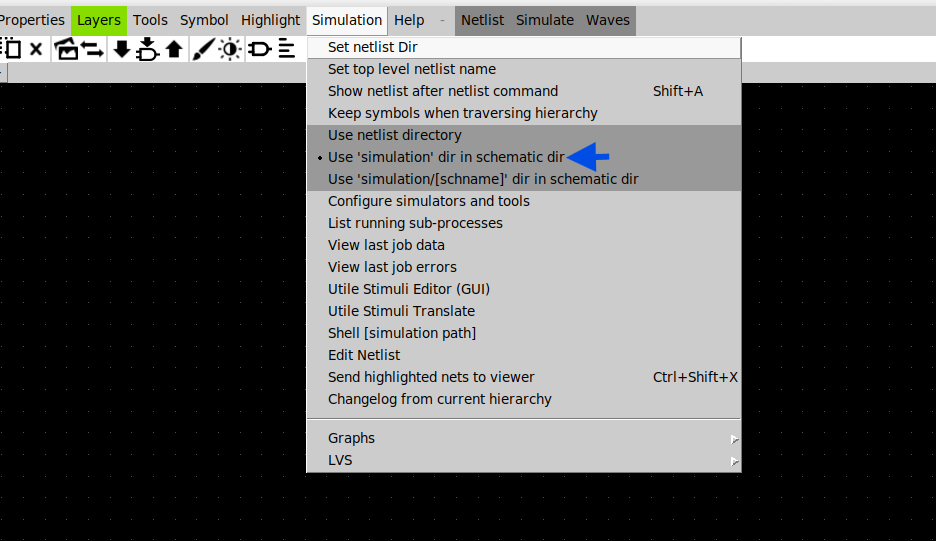
</p> 

<p align="center">
   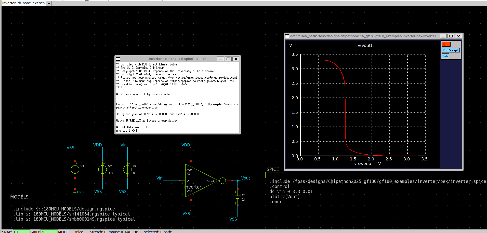
</p> 

If you want to double check that you are using the correct netlist, click on the **Simulation tab** and click on the **Edit Netlist**. A new window opens and it is possible to check the pex spice file path.

<p align="center">
   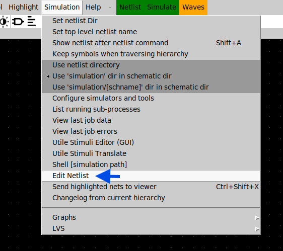
</p> 

<p align="center">
   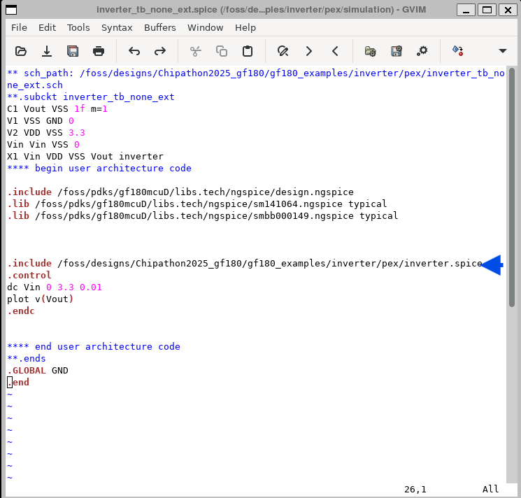
</p> 

Some references of this tutorial:
1) [Magic / Xschem / Ngspice Postlayout Simulation Tutorial](https://www.youtube.com/watch?v=8SMBSYiLbHM)
2) [run_ex.sh](https://github.com/gabrielmaranhao/Bracolin/blob/main/padframe/run_ex.sh)
